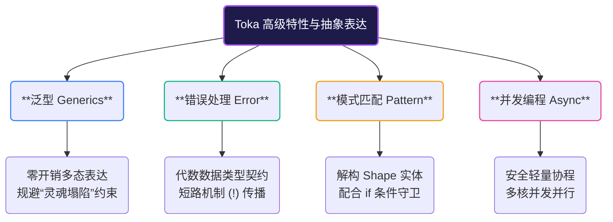

# 高级特性

在掌握了变量、控制流等语言基础，并深刻理解了 **帽子原则（Hat Principle）** 关于灵魂（Soul）与肉身（Handle）的管理之后，你已经跨过了 Toka 最陡峭的学习曲线。现在，我们将进入 Toka 的**高级特性**世界。

Toka 的高级特性是为了在保持**零拷贝隐式引用捕获**和**运行性能**的前提下，为开发者提供高层次的抽象表达力。在这里，你将看到强类型系统与代数数据类型的结合。

---

## 本章知识图谱

本章将带你深入探索以下四个系统开发的核心利器：

### 1. [泛型（Generics）](advanced/generics.md)
在强类型安全的前提下，提供零运行开销的多态表达。你将学习到独特的 **Morphic 泛型类型**（如 `'A`），以及在定义 Shape 时如何通过对应的 `'first` 单引号字段前缀来规避 **“灵魂塌陷（Soul Collapse）”** 的底层约束规则。

### 2. [错误处理](advanced/error_handling.md)
Toka 摒弃了运行时异常抛出机制，而是通过 `Option<T>` 和 `Result<T, E>` 代数数据类型来表达和传递错误。配合简洁的 `!` 短路操作符，让你的错误处理流程比传统的嵌套匹配更加清晰、直接。

### 3. [模式匹配](advanced/pattern_matching.md)
模式匹配允许你以直观的方式解构 Shape、分发逻辑。这里你将明确为何 Toka 强制使用 Variable Pattern 判定，并学习如何结合 `if` 条件守卫进行精细的范围与边界过滤。

### 4. [并发编程](advanced/concurrency.md)
Toka 提供了协程与线程基元，用于在内存安全的前提下构建并发系统。

---

> [!TIP]
> **心智模型转换提醒**
> 在阅读本大章时，请关注传统面向对象语言中继承体系和运行时多态的替代方案。Toka 的多态是通过 **Shape 解构、Trait 约束和模式匹配** 在编译期完成的。用好帽子原则，你的代码将兼具安全与高效的运行性能。
