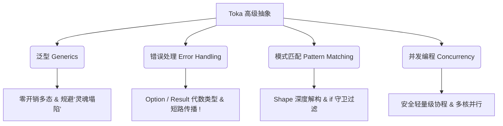

# 高级特性

在掌握了变量、控制流等语言基础，并深刻理解了 **帽子原则（Hat Principle）** 关于灵魂（Soul）与肉身（Handle）的管理之后，你已经跨过了 Toka 最陡峭的学习曲线。现在，我们将进入 Toka 的**高级特性**世界。

Toka 的高级特性并不是为了“炫技”而设计的复杂语法，而是为了在保持**零拷贝隐式引用捕获**和**极致运行效率**的前提下，为开发者提供高层次的抽象表达力。在这里，你将领略到强类型系统与代数数据类型的完美融合。

---

## 本章知识图谱

本章将带你深入探索以下四个系统开发的核心利器：

### 1. [泛型（Generics）](advanced/generics.md)
在强类型安全的前提下，提供零运行开销的多态表达。你将学习到极其独特的 **Morphic 泛型类型**（如 `'A`），以及在定义 Shape 时如何通过对应的 `'first` 单引号字段前缀来规避 **“灵魂塌陷（Soul Collapse）”** 的底层约束规则。

### 2. [错误处理](advanced/error_handling.md)
Toka 摒弃了复杂的运行时异常抛出机制，而是从类型系统出发，通过特化的 `Option<T>` 和 `Result<T, E>` 代数数据类型优雅地表达和传递错误。配合极其简洁的 `!` 短路操作符，让你的错误流比传统的嵌套匹配更具美感。

### 3. [模式匹配](advanced/pattern_matching.md)
作为 Toka 表达力最强的特性之一，模式匹配允许你以极其直观的方式解构 Shape、分发逻辑。这里你将明确为何 Toka 强制使用 Variable Pattern 判定，并学习如何优雅地结合 `if` 条件守卫进行精细的范围与边界过滤。

### 4. [并发编程](advanced/concurrency.md)
如何让你的代码安全地在多核 CPU 上飞驰？Toka 提供了极致轻量且安全的协程与线程基元，帮助你在避免死锁和数据竞争的前提下，构建高吞吐量的并发系统。

---

> [!TIP]
> **心智模型转换提醒**
> 在阅读本大章时，请暂时忘掉传统面向对象语言（如 Java/C++）中繁琐的继承体系和运行时多态负担。Toka 的多态是通过 **Shape 解构、Trait 约束和模式匹配** 在编译期完成的。用好帽子原则，你的高级代码将兼具极致的安全与惊艳的运行效率。
