# Advanced Features

Having mastered the language basics and gained a deep understanding of the **Hat Principle** regarding the management of Soul and Handle, you have already conquered Toka's steepest learning curve. Now, we enter the world of Toka's **Advanced Features**.

Toka's advanced features provide high-level abstract expressiveness while strictly adhering to the **Zero-Copy Capture Mechanism** and **runtime efficiency**. Here, you will see the integration of strong type systems and algebraic data types.

---

## Chapter Map

This chapter will guide you through the following four pillars of system development:

```mermaid
flowchart TD
    Root("Toka Advanced Features & Abstractions")

    Generics("**Generics**")
    Error("**Error Handling**")
    Pattern("**Pattern Matching**")
    Concurrency("**Concurrency**")

    GenericsDesc("Zero-overhead ADT representation<br>Avoid Soul Collapse")
    ErrorDesc("Algebraic data type contracts<br>Short-circuit (!) propagation")
    PatternDesc("Deconstruct Shapes<br>Combined w/ guards")
    ConcurrencyDesc("Lightweight fibers<br>Multicore scaling")

    Root --> Generics & Error & Pattern & Concurrency
    
    Generics --> GenericsDesc
    Error --> ErrorDesc
    Pattern --> PatternDesc
    Concurrency --> ConcurrencyDesc

    style Root fill:#1e1b4b,stroke:#a855f7,stroke-width:2px;
    style Generics stroke:#3b82f6,stroke-width:1.5px;
    style Error stroke:#10b981,stroke-width:1.5px;
    style Pattern stroke:#f59e0b,stroke-width:1.5px;
    style Concurrency stroke:#ec4899,stroke-width:1.5px;
```

### 1. [Generics](advanced/generics.md)
Achieve zero-overhead polymorphism while maintaining strong type safety. You will learn about Toka's unique **Morphic Generic Types** (like `'A`) and the strict rule of prefixing corresponding Shape fields with a single quote (e.g., `'first: 'A`) to avoid **"Soul Collapse"**.

### 2. [Error Handling](advanced/error_handling.md)
Toka discards runtime exception-throwing mechanisms. Instead, it leverages algebraic data types, specifically `Option<T>` and `Result<T, E>`, to represent and propagate errors. Together with the concise `!` short-circuit operator, your error handling will be clearer and more direct than nested pattern matches.

### 3. [Pattern Matching](advanced/pattern_matching.md)
Pattern matching allows you to deconstruct Shapes and dispatch logic intuitively. Here, you will understand how variable patterns binding and shadowing work under the hood, and learn to combine patterns with `if` guards for precise range and boundary checks.

### 4. [Concurrency](advanced/concurrency.md)
Toka provides coroutines and threading primitives to build concurrent systems safely.

---

> [!TIP]
> **Mental Model Shift**
> When reading this chapter, focus on alternative solutions to inheritance and runtime polymorphism. Toka achieves polymorphism at compile time through **Shape deconstruction, Trait constraints, and Pattern Matching**. Combined with the Hat Principle, your code will be both safe and highly efficient.
