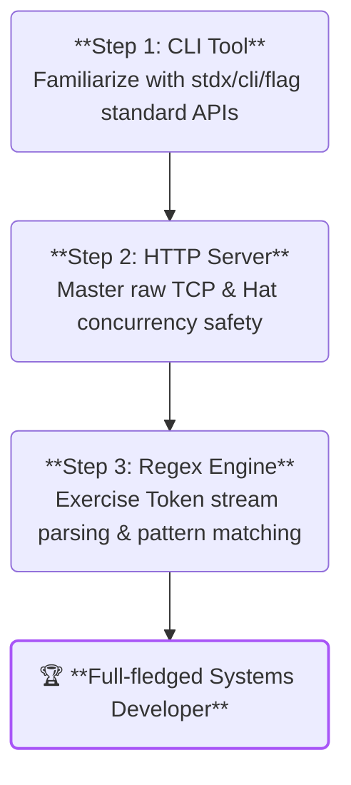

# Projects

Putting theory into practice is the single best way to truly master a systems programming language. Having mastered Toka's language basics, the Hat Principle, and advanced abstractions, this chapter will guide you through **three carefully designed practical projects** to complete your transformation from a syntax learner to a systems developer.

These projects are not detached "toy code." Instead, they directly target the three pillars of low-level software engineering: **systems tool development, high-performance concurrent networking, and language/text parsing**.

---

## Practical Roadmap

The three projects in this chapter progress in a step-by-step fashion to help you gradually build robust system-level development mental models:



### 1. [CLI Tool with stdx/cli/flag](projects/cli_tool.md)
*   **Engineering Value**: This is your first practical project. You will move away from outdated multi-level chain calls and learn to leverage the official standard `stdx/cli/flag` extension package. You will elegently parse flags, handle boolean options using the non-chained mutable `self#` API, and safely collect and filter positional arguments with pattern matching.

### 2. [High-Performance HTTP Server](projects/http_server.md)
*   **Engineering Value**: How do you build highly concurrent, low-level network services in Toka? In this project, you will start with low-level TCP listening (`TcpListener`) and connection acceptance (`accept()`). Combined with multi-threaded concurrency, you will handcraft an RFC-compliant concurrent HTTP response server. This is a comprehensive test of your understanding of the Hat Principle and Toka's I/O modules.

### 3. [Regex Engine](projects/regex.md)
*   **Engineering Value**: Text matching and compiler frontends are fascinating areas of systems programming. You will challenge yourself to implement a micro regular expression engine from scratch. In this project, you will deeply train your control over token streams, state machine transitions, deep tree structure representations, and learn to leverage Toka's elegant `match` pattern matching for complex lexical and syntactic branching.

---

> [!IMPORTANT]
> **Development & Debugging Preparation**
> Before starting each project, make sure you have correctly configured your `toka` command-line environment and that the `tokac` compiler works properly. You can quickly run and debug your project using the following basic command:
> ```bash
> toka run src/main.tk -- -n Toka
> ```
> In each project chapter, detailed unit tests and execution examples are provided. It is highly recommended that you type every line of code yourself and observe compiler error outputs. This will give you a deep, visceral intuition for Toka's "Handle" and "Soul" rebinding rules.
